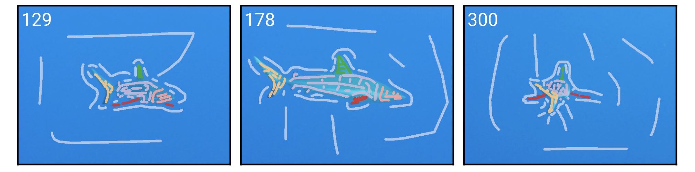

[](https://github.com/guiwitz/napari-convpaint/raw/main/LICENSE)
[](https://pypi.org/project/napari-convpaint)
[](https://python.org)
[](https://github.com/guiwitz/napari-convpaint/actions)
[](https://codecov.io/gh/guiwitz/napari-convpaint)
[](https://napari-hub.org/plugins/napari-convpaint)


This napari plugin can be used to segment objects or structures in images based on a few brush strokes providing examples of the classes. Based on the same idea as other tools like ilastik, its main strength is that it can use features from pretrained neural networks like VGG16 or DINOV2, enabling the segmentation of more complex images.

**Find more information and tutorials in the [docs](https://guiwitz.github.io/napari-convpaint/) or read the [preprint](https://doi.org/10.1101/2024.09.12.610926).**


## Installation

You can install `napari-convpaint` via [pip]

    pip install napari-convpaint

To install latest development version :

    pip install git+https://github.com/guiwitz/napari-convpaint.git


## Example use case: Tracking shark body parts in a movie
These are the scribble annotations provided for training:


And this is the resulting Convpaint segmentation:
<video src="https://github.com/user-attachments/assets/6a2be1fe-25cc-4af1-9f50-aab9bc4123d9"></video>

Check out the documentation or the paper for more usecases!

## License

Distributed under the terms of the [BSD-3] license,
"napari-convpaint" is free and open source software

## Contributing

Contributions are very welcome. Tests can be run with [tox], please ensure
the coverage at least stays the same before you submit a pull request.

## Issues

If you encounter any problems, please [file an issue] along with a detailed description.

[napari]: https://github.com/napari/napari
[Cookiecutter]: https://github.com/audreyr/cookiecutter
[@napari]: https://github.com/napari
[MIT]: http://opensource.org/licenses/MIT
[BSD-3]: http://opensource.org/licenses/BSD-3-Clause
[GNU GPL v3.0]: http://www.gnu.org/licenses/gpl-3.0.txt
[GNU LGPL v3.0]: http://www.gnu.org/licenses/lgpl-3.0.txt
[Apache Software License 2.0]: http://www.apache.org/licenses/LICENSE-2.0
[Mozilla Public License 2.0]: https://www.mozilla.org/media/MPL/2.0/index.txt
[cookiecutter-napari-plugin]: https://github.com/napari/cookiecutter-napari-plugin

[file an issue]: https://github.com/guiwitz/napari-convpaint/issues

[napari]: https://github.com/napari/napari
[tox]: https://tox.readthedocs.io/en/latest/
[pip]: https://pypi.org/project/pip/
[PyPI]: https://pypi.org/

## Authors

The idea behind this napari plugin was first developed by [Lucien Hinderling](https://hinderling.github.io) in the group of [Olivier Pertz](https://www.pertzlab.net/), at the Institute of Cell Biology, University of Bern. The code has first been shared as open source resource in form of a [Jupyter Notebook](https://github.com/hinderling/napari_pixel_classifier). With the desire to make this resource accessible to a broader public in the scientific community, the Pertz lab obtained a CZI napari plugin development grant with the title ["Democratizing Image Analysis with an Easy-to-Train Classifier"](https://chanzuckerberg.com/science/programs-resources/imaging/napari/democratizing-image-analysis-with-an-easy-to-train-classifier/) which supported the adaptation of the initial concept as a napari plugin called napari-convpaint. The plugin has been developed by [Guillaume Witz](https://guiwitz.github.io/blog/about/), Mykhailo Vladymyrov and Ana Stojiljkovic at the [Data Science Lab](https://www.dsl.unibe.ch/), University of Bern, in tight collaboration with the Pertz lab (Lucien Hinderling, [Roman Schwob](https://github.com/quasar1357), [Benjamin Gräedel](https://x.com/benigraedel), [Maciej Dobrzyński](https://macdobry.net)).

## Cite Convpaint

If you find Convpaint useful in your research, please consider citing:
```
@article {Hinderling2024.09.12.610926,
	author = {Hinderling, Lucien and Witz, Guillaume and Schwob, Roman and Stojiljkovic, Ana and Dobrzynski, Maciej and Vladymyrov, Mykhailo and Frei, Joel and Graedel, Benjamin and Frismantiene, Agne and Pertz, Olivier},
	title = {Convpaint - Universal framework for interactive pixel classification using pretrained neural networks},
	year = {2024},
	doi = {10.1101/2024.09.12.610926},
	URL = {https://www.biorxiv.org/content/early/2024/09/14/2024.09.12.610926},
	journal = {bioRxiv}
}
```